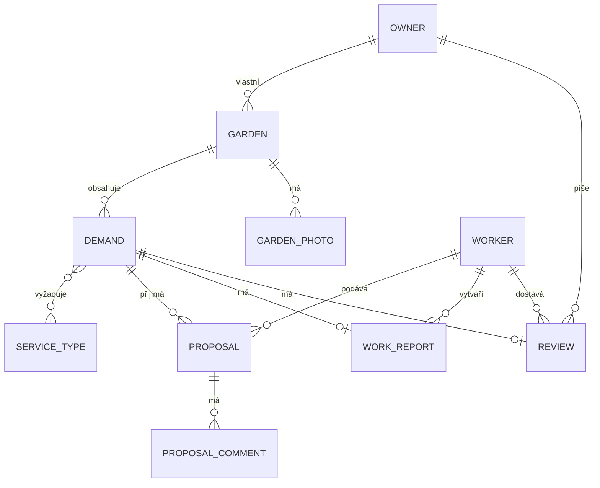

# Zahrada - backend

REST API pro aplikaci na správu zahrad a poptávek zahradnických prací.
Spring Boot 4.0.3, Java 17, H2, JWT.

## Požadavky

- JDK 17
- Maven (nebo přiložený wrapper `./mvnw`)

Ověření verze:

```bash
java -version
```

## Spuštění

```bash
./mvnw spring-boot:run
```

Aplikace běží na `http://localhost:8080`.

Alternativně sestavení a spuštění jaru:

```bash
./mvnw clean package
java -jar target/zahrada_backend-0.0.1-SNAPSHOT.jar
```

## Databáze

Používá se vestavěná H2 v souborovém režimu - není potřeba nic instalovat.
Data se ukládají do složky `data/` v kořeni projektu.

Webová konzole: `http://localhost:8080/h2-console`

| Pole     | Hodnota                  |
|----------|--------------------------|
| JDBC URL | `jdbc:h2:file:./data/garden` |
| User     | `sa`                     |
| Password | (prázdné)                |

Přesné hodnoty jsou v `src/main/resources/application.properties`.

Schéma se generuje automaticky (`ddl-auto=update`).
Reset databáze - smazat složku a restartovat aplikaci:

```bash
rm -rf data/
```

## Dokumentace API

Swagger UI: `http://localhost:8080/swagger-ui.html`
OpenAPI JSON: `http://localhost:8080/v3/api-docs`

## Autentizace

JWT. Token se získá registrací nebo přihlášením a posílá se v hlavičce
`Authorization: Bearer <token>`.

Veřejné endpointy: `/api/auth/**`, `/api/demands/catalog`, `/api/service-types`,
`/swagger-ui/**`, `/v3/api-docs/**`, `/h2-console/**`, `/actuator/health`.
Vše ostatní vyžaduje platný token (podrobná matice viz [Role a přístupová matice](#role-a-přístupová-matice)).

Registrace:

```bash
curl -X POST http://localhost:8080/api/auth/register \
  -H "Content-Type: application/json" \
  -d '{"firstName":"Eva","lastName":"Dvorakova","role":"WORKER","email":"eva@example.com","password":"heslo1234"}'
```

Přihlášení:

```bash
curl -X POST http://localhost:8080/api/auth/login \
  -H "Content-Type: application/json" \
  -d '{"email":"eva@example.com","password":"heslo1234"}'
```

Role: `OWNER` (majitel zahrady), `WORKER` (pracovník).

## Konfigurace

Klíčové vlastnosti v `application.properties`:

| Vlastnost              | Popis                          |
|------------------------|--------------------------------|
| `app.jwt.secret`       | Base64 klíč pro podpis tokenů  |
| `app.jwt.expiration`   | Platnost tokenu v ms           |
| `spring.datasource.url`| Umístění H2 databáze           |

## Struktura projektu

```
upce/fei/garden/
  config/      - CORS, OpenAPI, request-logging filtr, seed číselníku služeb
  controller/  - REST endpointy
  dto/         - přenosové objekty
  exception/   - vlastní výjimky, globální handler
  model/       - JPA entity
  repository/  - přístup k datům
  security/    - JWT, filtry, konfigurace přístupu
  service/     - business logika
  validation/  - vlastní validační pravidla
```

## Architektura

Klasická vrstvená architektura, každá vrstva zná jen tu pod sebou:

```
Controller (@RestController, REST/JSON, autorizace @PreAuthorize)
    │  volá
    ▼
Service (@Service, @Transactional, business logika a business validace)
    │  volá
    ▼
Repository (Spring Data JPA - JpaRepository / JpaSpecificationExecutor)
    │  čte/zapisuje
    ▼
Entity (@Entity, model/) ── uložené v H2
```

Doplňkové vrstvy:

- **`dto/`** - hraniční objekty API. Controller nikdy nevrací ani nepřijímá entitu přímo;
  převod entita ↔ DTO dělají package-private třídy `*Mapper` uvnitř `service/` (např.
  `DemandMapper`), aby servisní třída (`DemandService`) obsahovala jen business logiku a mapování
  šlo testovat/měnit odděleně.
- **`security/`** - `JwtAuthenticationFilter` (ověří JWT z hlavičky a naplní
  `SecurityContext`), `JwtService` (podpis/validace tokenu), `CurrentUserService` (jednotný
  přístup k přihlášenému uživateli z libovolné service třídy) a `SecurityConfig` (pravidla
  přístupu, viz [Zabezpečení](#zabezpečení)).
- **`exception/`** - vlastní výjimky (`NotFoundException`, `ConflictException`,
  `ForbiddenException`, `ValidationException`) a `GlobalExceptionHandler`, který je mapuje na
  jednotný formát chybové odpovědi (`ApiError`) a stará se o logování (viz
  [Logování a monitoring](#logování-a-monitoring)).
- **`validation/`** - vlastní Bean Validation pravidla nad rámec standardních anotací (viz
  [Vlastní validace](#vlastní-validace)).
- **`config/`** - průřezová konfigurace nezávislá na doméně (CORS, OpenAPI/Swagger, filtr
  logující requesty, naplnění číselníku služeb při startu).

## Datový model



`Owner` a `Worker` dědí společné údaje (e-mail, jméno, heslo, telefon, avatar) z abstraktní
entity `User` přes `@Inheritance(strategy = JOINED)` - v databázi jsou tedy tři propojené
tabulky (`users`, `owner`, `worker`), ale v kódu jde o jednu hierarchii tříd.

Životní cyklus poptávky (`Demand.status`): `NOVA → SCHVALENA → CEKA_NA_PLATBU → ZAPLACENA →
PRACE_DOKONCENY → PRACE_SCHVALENY` (případně `ZRUSENA` kdykoliv). Do stavu `SCHVALENA` se
poptávka dostane přijetím jednoho z návrhů (`ProposalService#accept`), čímž se zároveň zamítnou
(`ZAMITNUT`) všechny ostatní návrhy stejné poptávky.

> **Poznámka:** entity `WorkReport`, `Review`, `ProposalComment` a `GardenPhoto` (a jejich DTO
> ve `dto/workreport`, `dto/review`) jsou v datovém modelu připravené pro navazující etapy, ale
> zatím k nim není žádný REST endpoint - nejsou tedy ani v Swagger dokumentaci.

## Role a přístupová matice

Aplikace má dvě role: **`OWNER`** (vlastník zahrady - zadává poptávky, vybírá zahradníka) a
**`WORKER`** (zahradník - prohlíží veřejný katalog poptávek a podává na ně návrhy).

| Endpoint                                  | Metoda | Neautorizovaný | OWNER | WORKER |
|--------------------------------------------|--------|:---:|:---:|:---:|
| `/api/auth/register`, `/api/auth/login`    | POST   | ✅ | ✅ | ✅ |
| `/api/service-types`                       | GET    | ✅ | ✅ | ✅ |
| `/api/demands/catalog`                     | GET    | ✅ | ✅ | ✅ |
| `/api/profile`                             | GET    | ❌ | ✅ | ✅ |
| `/api/profile/owner`                       | PUT    | ❌ | ✅ | ❌ |
| `/api/profile/worker`                      | PUT    | ❌ | ❌ | ✅ |
| `/api/gardens` (list/detail/create/update/delete) | *   | ❌ | ✅ | ❌ |
| `/api/demands`, `/api/demands/statistics`  | GET    | ❌ | ✅ | ❌ |
| `/api/gardens/{gardenId}/demands`          | GET, POST | ❌ | ✅ | ❌ |
| `/api/demands/{id}`                        | GET    | ❌ | ✅ (jen svá) | ✅ (jen stav `NOVA`) |
| `/api/demands/{id}`                        | PUT, DELETE | ❌ | ✅ | ❌ |
| `/api/demands/{demandId}/proposals`        | POST   | ❌ | ❌ | ✅ |
| `/api/demands/{demandId}/proposals`        | GET    | ❌ | ✅ (jen svá poptávka) | ❌ |
| `/api/proposals/my`                        | GET    | ❌ | ❌ | ✅ |
| `/api/proposals/{id}/accept`, `/reject`    | POST   | ❌ | ✅ | ❌ |
| `/api/proposals/{id}`                      | DELETE | ❌ | ❌ | ✅ (jen svůj, ve stavu `NOVY`) |
| `/actuator/health`                         | GET    | ✅ | ✅ | ✅ |
| `/actuator/info` a ostatní actuator        | GET    | ❌ | ✅ | ✅ |
| `/swagger-ui/**`, `/v3/api-docs/**`, `/h2-console/**` | *  | ✅ | ✅ | ✅ |

Role se vynucuje na dvou úrovních zároveň: `SecurityConfig` (které cesty vůbec vyžadují token) a
metodová anotace `@PreAuthorize("hasRole(...)")` na controlleru (která přesně roli patří).
"✅ (jen svá/svůj)" v tabulce znamená, že vlastnictví záznamu se navíc ověřuje v servisní vrstvě
(viz [Zabezpečení](#zabezpečení)).

## Zabezpečení

- **Autentizace** - stateless JWT (`io.jsonwebtoken`/JJWT). Token nese e-mail a roli, podepisuje
  se HMAC klíčem z `app.jwt.secret` a má platnost `app.jwt.expiration` ms. `JwtAuthenticationFilter`
  běží před `UsernamePasswordAuthenticationFilter`, ověří token z hlavičky `Authorization: Bearer
  <token>` a naplní `SecurityContext`; neplatný/chybějící token požadavek nezastaví - o odmítnutí
  rozhodne až autorizace v `SecurityConfig` (chráněná cesta bez platné identity vrátí 401 přes
  `JwtAuthenticationEntryPoint`).
- **Hesla** - nikdy se neukládají ani neloguje v čitelné podobě, hashují se přes `BCryptPasswordEncoder`.
- **Autorizace** - `@PreAuthorize("hasRole(...)")` na controllerech (viz přístupová matice výše).
- **Vlastnictví záznamů → 404, ne 403.** Pokud vlastník zkusí přistoupit k cizí zahradě/poptávce,
  nebo zahradník k poptávce mimo stav `NOVA`, servisní vrstva to hlásí jako `NotFoundException`
  (HTTP 404), ne jako zákaz přístupu (403). Cizímu uživateli tak nechceme prozrazovat, že daný
  záznam vůbec existuje - stejná konvence napříč `GardenService`, `DemandService` i
  `ProposalService`. Naproti tomu čistě roli patřící akce (např. `WORKER` volající endpoint jen
  pro `OWNER`) je zablokována dřív, na úrovni `@PreAuthorize`, a vrací 403.
- **CORS** - povolen jen frontend na `http://localhost:5173` (viz `CorsConfig`).
- **Actuator** - `/actuator/health` je veřejné (vrací i detaily, `management.endpoint.health.show-details=always`),
  ostatní actuator endpointy (`/actuator/info` apod.) vyžadují platný token stejně jako zbytek API.
- **Logování požadavků** - `RequestLoggingFilter` loguje na INFO každý požadavek na `/api/**`
  (metoda, cesta, stavový kód, doba trvání); hlavičky ani tělo požadavku se nelogují, takže se do
  logu nikdy nedostane heslo ani token.

## Vlastní validace

Kromě standardních Bean Validation anotací (`@NotBlank`, `@Size`, `@Email`, ...) projekt
obsahuje dvě vlastní deklarativní pravidla v balíčku `validation/` (`validation/rules` -
anotace, `validation/validator` - implementace `ConstraintValidator`):

| Anotace | Kde se používá | Pravidlo |
|---------|-----------------|----------|
| `@FutureOrToday` | `CreateDemandRequest.desiredDate` | Datum nesmí ležet v minulosti (dnešek i budoucnost jsou platné). |
| `@ValidCzechPhone` | `UpdateOwnerProfileRequest.phoneNumber`, `UpdateWorkerProfileRequest.phoneNumber` | Formát `+420` a devět číslic, mezery volitelné; `null`/prázdný řetězec je platný (telefon je nepovinný). |

Obě chyby se vrací jako HTTP 400 s `fieldErrors` mapou (název pole → chybová zpráva), stejně
jako standardní Bean Validation chyby - viz `GlobalExceptionHandler#handleMethodArgumentNotValid`.

Kromě toho projekt obsahuje i **programovou (business) validaci** tam, kde pravidlo závisí na
stavu souvisejících záznamů v databázi, ne jen na tvaru jednoho DTO - to nelze vyjádřit
deklarativní anotací nad polem. Příklad: `DemandService#ensureNoProposals` - poptávku, ke které
už existuje alespoň jeden návrh, nelze upravit ani smazat (HTTP 409). Podobně
`ProposalService#create` kontroluje, že poptávka je ve stavu `NOVA` a že daný zahradník na ni
ještě nepodal návrh.

## Logování a monitoring

- Aplikační logger `upce.fei.garden` běží defaultně na úrovni `INFO` (`application.properties`).
  Pro ladění lze bez zásahu do kódu dočasně zvednout na `DEBUG`, např.
  `-Dlogging.level.upce.fei.garden=DEBUG` nebo proměnnou prostředí `LOGGING_LEVEL_UPCE_FEI_GARDEN=DEBUG`.
- Každá klíčová operace (registrace, přihlášení, vytvoření/úprava/smazání zahrady či poptávky,
  podání/přijetí/zamítnutí/odvolání návrhu) má log na úrovni INFO; porušení oprávnění nebo
  business pravidla (cizí záznam, návrh mimo očekávaný stav apod.) na úrovni WARN.
- `GlobalExceptionHandler` loguje očekávané chyby (400/401/403/404/409...) na WARN jen se
  zprávou bez stack trace; neočekávanou chybu (500) na ERROR s celým stack trace.
- `RequestLoggingFilter` loguje každý požadavek na `/api/**` (viz [Zabezpečení](#zabezpečení)).
- `/actuator/health` (veřejné, s detaily) a `/actuator/info` (pod tokenem) - viz
  [Zabezpečení](#zabezpečení).

## Testování

Testy jsou rozdělené na dvě vrstvy a běží proti in-memory H2 databázi (profil `test`,
`src/test/resources/application-test.properties`), takže se nikdy nedotknou souborové databáze
ve `data/`:

- **Unit testy** (`src/test/java/.../service/*Test.java`) - JUnit 5 + Mockito, bez Spring
  kontextu; repozitáře a `CurrentUserService` jsou mockované, testuje se jen business logika
  service třídy (např. `DemandServiceTest`).
- **Integrační testy** (`src/test/java/.../controller/*IntegrationTest.java`) - `@SpringBootTest`
  + `MockMvc` nad reálným Spring kontextem, autorizace se neobchází: uživatelé se registrují
  přes `/api/auth/register` a v requestech se posílá skutečný vrácený JWT (např.
  `DemandControllerIntegrationTest`).

Spuštění celé sady:

```bash
./mvnw test
```

> Třídy testů musí končit na `Test`/`Tests` (ne `IT`) - Maven Surefire (spouštěný fází `test`)
> jinak takové testy přeskočí, protože přípona `IT` je konvence pro Failsafe/fázi
> `integration-test`, kterou tento projekt nepoužívá.