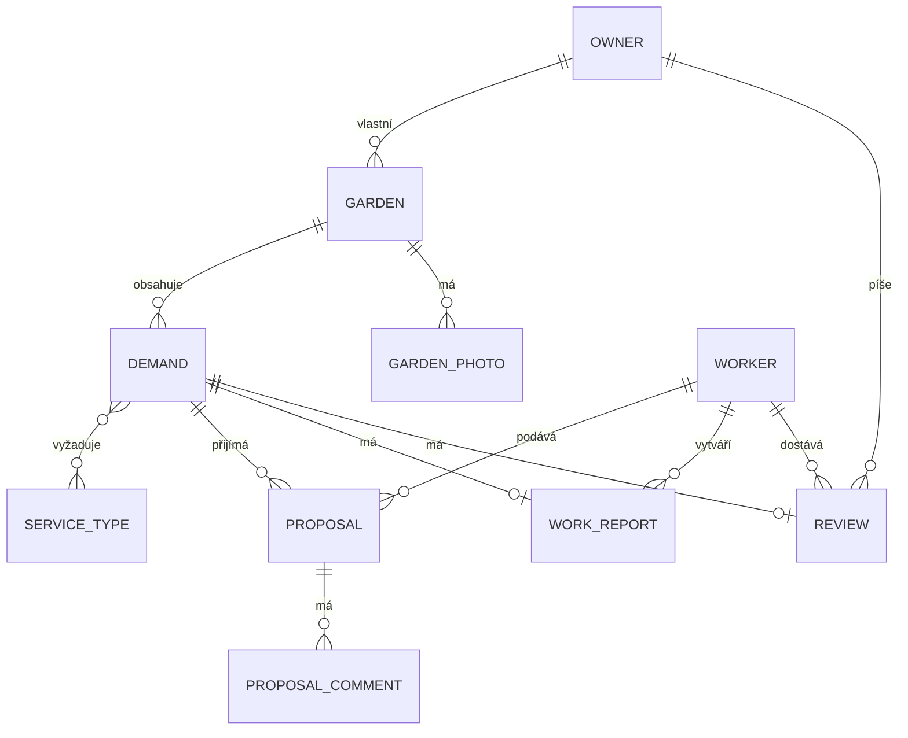
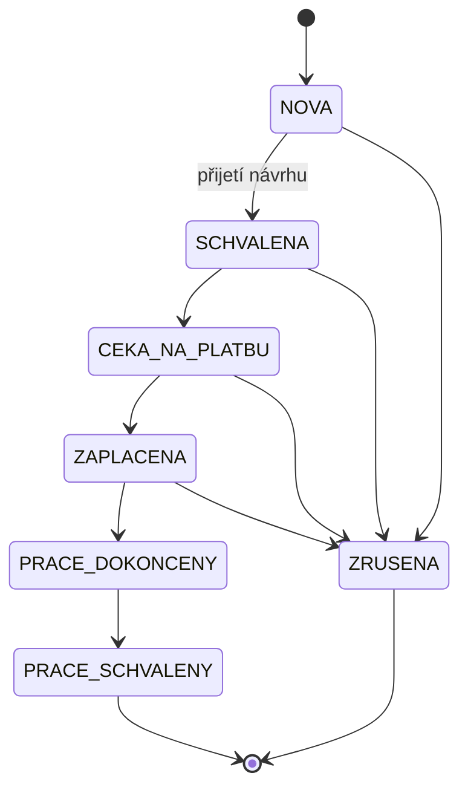
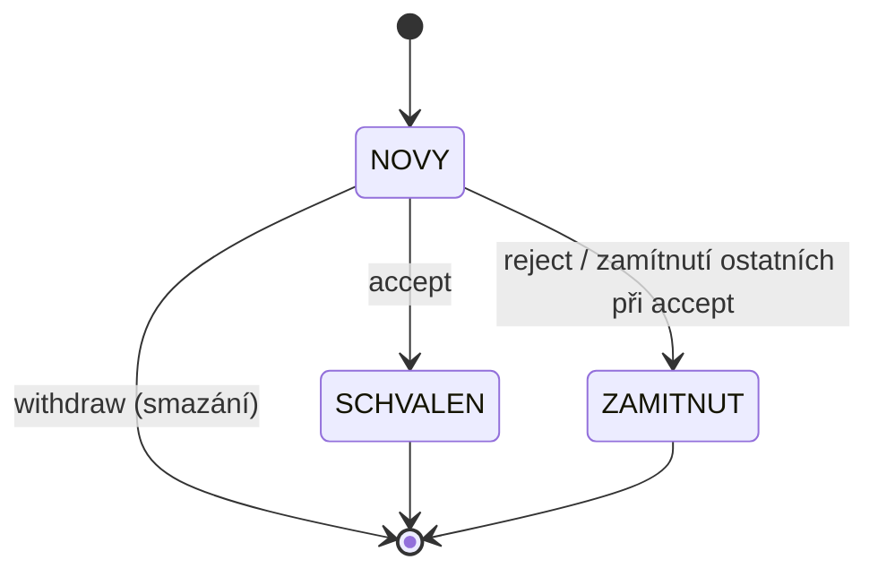

# Technická dokumentace - Zahrada (backend)

## 1. Účel aplikace

Zahrada je REST API pro webovou/mobilní aplikaci, která propojuje **vlastníky zahrad** s
**zahradníky**. Vlastník zahrady zadá poptávku (jaké práce potřebuje a s jakou naléhavostí),
zahradníci na ni mohou podat návrh (cenová nabídka a popis), vlastník si vybere jeden z návrhů a
schválí ho - ostatní návrhy se automaticky zamítnou. Aplikace dále eviduje profily obou rolí,
zahrady vlastníka (včetně fotografie) a číselník typů zahradnických služeb.

Cílem backendu je poskytnout bezpečné, dobře zdokumentované a otestované REST API, které
frontend (samostatný projekt) volá přes JSON přes HTTP.

## 2. Použité technologie

| Vrstva | Technologie | Proč zvoleno |
|---|---|---|
| Jazyk | Java 17 | moderní LTS verze vhodná pro Spring Boot 4 |
| Backend | Spring Boot 4.0.3 | rychlé vytváření REST API a správná podpora pro Java 17 |
| API a bezpečnost | Spring MVC, Spring Security, JWT | standardní řešení pro REST endpointy, autentizaci a autorizaci |
| Data | Spring Data JPA + Hibernate, H2 | jednoduchá práce s databází bez nutnosti samostatné instalace |
| Validace | Bean Validation + vlastní pravidla | snadná validace vstupů na úrovni DTO |
| Dokumentace | OpenAPI / Swagger | automatická dokumentace API z anotací |
| Testování | JUnit 5, Mockito, Spring Boot Test | běžný a efektivní stack pro unit i integrační testy |
| Build | Maven (`./mvnw`) | jednoduché spuštění buildu bez lokální instalace Mavenu |

## 3. Architektura

Aplikace je postavena jako klasická vrstvená monolitická architektura:

```
HTTP request
    |
    v
Controller (REST, @RestController)      - přijme/vrátí DTO, autorizace @PreAuthorize
    |
    v
Service (@Service, @Transactional)      - business logika, vlastnictví záznamů, validace
    |
    v
Repository (Spring Data JPA)            - dotazy nad databází
    |
    v
Entity (@Entity)                        - JPA mapování na tabulky
```

Každá vrstva zná jen tu bezprostředně pod sebou - controller nikdy nevolá repository přímo a
nikdy nepracuje s entitou.

Balíčky (`upce.fei.garden.*`):

- **`controller`** - REST endpointy, mapování HTTP metod na service volání, autorizace přes
  `@PreAuthorize`, Swagger anotace (`@Tag`, `@Operation`, `@Parameter`).
- **`service`** - business logika. Každá doménová oblast (Auth, Garden, Demand, Proposal,
  Profile, ServiceType) má vlastní service třídu. Vedle toho `FileStorageService` řeší ukládání
  nahraných souborů na disk (viz [Bezpečnost](#5-bezpečnost)) a je service vrstvě k dispozici
  jako běžná závislost.
- **`dto`** - přenosové objekty pro request/response; entity se nikdy nevrací přímo z
  controlleru ven z aplikace.
- **`model`** - JPA entity a jejich enum stavy (`DemandStatus`, `ProposalStatus`, `DemandUrgency`,
  `UserRole`).
- **`repository`** - rozhraní `JpaRepository`/`JpaSpecificationExecutor` s odvozenými i
  vlastními (`@Query`) dotazy.
- **`security`** - JWT filtr a služba, `CurrentUserService` (jednotný přístup k přihlášenému
  uživateli), `SecurityConfig` (pravidla přístupu k jednotlivým cestám).
- **`exception`** - vlastní výjimky a `GlobalExceptionHandler`, který je centrálně převádí na
  jednotný formát chybové odpovědi a loguje.
- **`validation`** - vlastní Bean Validation pravidla (anotace + `ConstraintValidator`).
- **`config`** - průřezová konfigurace nezávislá na doméně: CORS (`CorsConfig`), OpenAPI
  (`OpenApiConfig`), logovací filtr (`RequestLoggingFilter`), naplnění číselníku služeb při
  startu (`ServiceTypeDataInitializer`), registrace H2 konzole mimo testovací profil
  (`H2ConsoleConfig`) a statický resource handler pro nahrané fotografie (`WebMvcConfig`).

Hlavní doménové oblasti a jejich endpointy: autentizace (`/api/auth`), profil
(`/api/profile`), zahrady včetně jejich fotografie (`/api/gardens`), poptávky (`/api/demands`,
veřejný katalog `/api/demands/catalog`, číselník naléhavosti `/api/demands/urgencies`) a návrhy
zahradníků (`/api/demands/{id}/proposals`, `/api/proposals/**`). Entity `WorkReport`, `Review`,
`ProposalComment` a `GardenPhoto` jsou v datovém modelu připravené pro navazující etapy vývoje,
ale zatím nemají REST endpoint (viz [Známá omezení](#11-známá-omezení)).

## 4. Datový model

Klíčové entity a vztahy:



`Owner` a `Worker` dědí společné údaje (e-mail, heslo, jméno, telefon, adresa URL avataru, datum
registrace) z abstraktní entity `User` přes `@Inheritance(strategy = JOINED)` - v databázi tak
vzniknou tři propojené tabulky (`users`, `owner`, `worker`) spojené primárním klíčem, ale v kódu
jde o jednu hierarchii tříd. 

**Životní cyklus poptávky** (`Demand.status`, enum `DemandStatus`):



Do stavu `NOVA` se poptávka dostane vytvořením a v tomto stavu je jediná viditelná ve veřejném
katalogu pro zahradníky i jediná, na kterou lze podat návrh (`ProposalService#create`). Přechod
do `SCHVALENA` nastává výhradně přijetím jednoho z návrhů.

**Životní cyklus návrhu** (`Proposal.status`, enum `ProposalStatus`):



`ProposalService#accept` provede všechny změny najednou v jedné transakci. Pokud je jeden návrh
přijat, tento návrh se označí jako `SCHVALEN`, všechny ostatní návrhy k téže poptávce se
zamítnou a sama poptávka přejde do stavu `SCHVALENA`. 

## 5. Bezpečnost

Aplikace používá jednoduchý a přehledný model zabezpečení:

- Přístup je chráněn pomocí JWT a rolí (`OWNER`, `WORKER`).
- Klient pošle token v hlavičce `Authorization: Bearer <token>`.
- `JwtAuthenticationFilter` ověří token, ale samotné rozhodnutí o přístupu dělá až `SecurityConfig`
a `@PreAuthorize` na controlleru.
- Veřejné cesty jsou např. registrace, katalog poptávek, seznam typů služeb, uploady,
  Swagger a health endpoint.
- Přístup k cizímu záznamu vrací `404` místo `403`, aby se neprozradila existence daného záznamu.
- Hesla se ukládají jako BCrypt hash a JWT je bezstavové a má omezenou platnost.
- CORS je povolen jen pro frontend na `http://localhost:5173`.
- Nahrané fotografie se kontrolují před uložením — zkoumá se jejich typ i obsah, aby se zabránilo
  zneužití typu uploadu nebo path traversal.
- `/actuator/health` je veřejný, ostatní actuator endpointy vyžadují autentizaci.

## 6. Validace

Aplikace kombinuje tři úrovně validace:

1. **Standardní Bean Validation** - `@NotBlank`, `@Size`, `@Email`, `@Positive`, `@Pattern` atd.
   na request DTO, vyhodnocované automaticky přes `@Valid` v controlleru.
2. **Vlastní deklarativní pravidla** (balíček `validation`, dělený na `validation.rules` -
   anotace a `validation.validator` - implementace `ConstraintValidator`):
   - `@ValidCzechPhone` - telefon ve formátu `+420` a devět číslic (mezery volitelné), `null`
     nebo prázdný řetězec je platný, protože telefon je nepovinný údaj.

   Obě chyby se vrací jako HTTP 400 s mapou `fieldErrors` (název pole -> chybová zpráva), stejně
   jako standardní Bean Validation chyby.
3. **Programová (business) validace** - pravidla, která závisí na stavu souvisejících záznamů
   v databázi nebo na obsahu binárních dat, ne jen na tvaru jednoho DTO, a proto je nelze
   vyjádřit deklarativní anotací nad polem. Příklady: poptávku, ke které už existuje alespoň
   jeden návrh, nelze upravit ani smazat (`DemandService#ensureNoProposals`, HTTP 409); na
   poptávku mimo stav `NOVA` nelze podat návrh a jeden zahradník smí na poptávku podat jen jeden
   návrh (`ProposalService#create`); návrh lze přijmout/zamítnout/odvolat jen ve stavu `NOVY`
   (`ProposalService#ensureNovy`); nahraný soubor fotografie musí projít kontrolou velikosti,
   deklarovaného typu i skutečné signatury obsahu (`FileStorageService#store`, viz
   [Bezpečnost](#5-bezpečnost)). Tato pravidla vyhazují `ConflictException` (409) nebo
   `ValidationException` (400) a jsou zdokumentovaná Javadocem přímo u dané metody.

## 7. Zpracování chyb

`GlobalExceptionHandler` (`@RestControllerAdvice`) centrálně převádí všechny výjimky na jednotný
formát odpovědi `ApiError` (`timestamp`, `status`, `error`, `message`, `path`, volitelně
`fieldErrors`), takže klient nikdy nedostane surový stack trace ani netypizovanou chybu.

| Výjimka / situace | HTTP status |
|---|---|
| `NotFoundException` | 404 |
| `NoResourceFoundException`, `NoHandlerFoundException` (neexistující cesta) | 404 |
| `AuthenticationException` (neplatné přihlašovací údaje) | 401 |
| `ForbiddenException` | 403 |
| `AccessDeniedException` (zamítnutí ze Spring Security, např. `@PreAuthorize`) | 403 |
| `ConflictException` | 409 |
| `ValidationException` (vlastní programová validace) | 400 (s `fieldErrors`) |
| `MethodArgumentNotValidException` (Bean Validation na `@Valid` DTO) | 400 (s `fieldErrors`) |
| `HttpMessageNotReadableException` (poškozený/neplatný JSON) | 400 |
| `MaxUploadSizeExceededException` (soubor větší než `spring.servlet.multipart.max-file-size`) | 400 |
| `HttpRequestMethodNotSupportedException` (nepodporovaná HTTP metoda na dané cestě) | 405 |
| cokoliv jiné (`Exception`) | 500 |

Rozdělení logování mezi jednotlivé handlery odráží, jestli jde o běžný, předvídatelný stav
aplikace, nebo o skutečnou závadu: **očekávané** chyby (celý řádek tabulky kromě posledního) se
logují na úrovni WARN jen se zprávou, bez stack trace - stack trace by tu byl jen šum, protože
příčina (cizí záznam, špatný vstup, konflikt stavu) je vždy zjevná ze zprávy. Poslední řádek,
neočekávaná chyba (500), se loguje na ERROR i s celým stack trace, protože jde o skutečnou
závadu (bug, výpadek závislosti apod.), kterou je potřeba dohledat v kódu - bez stack trace by
nebyla dohledatelná.

## 8. Logování a monitoring

- Logování je přes SLF4J/Logback (výchozí v Spring Boot), aplikační logger `upce.fei.garden`
  běží na úrovni `INFO`; pro ladění lze bez zásahu do kódu dočasně přepnout na `DEBUG` přes
  systémovou vlastnost nebo proměnnou prostředí. SQL dotazy Hibernate jsou v `application.properties`
  natrvalo na `DEBUG` (parametry vazeb dokonce na `TRACE`) - jde o vývojářské pohodlí (vidět
  přesně, jaké SQL a s jakými parametry Hibernate generuje), ne o produkční nastavení.
- Každá klíčová operace (registrace, přihlášení, vytvoření/úprava/smazání zahrady, poptávky nebo
  fotografie, podání/přijetí/zamítnutí/odvolání návrhu) loguje na úrovni `INFO`. Porušení
  oprávnění nebo business pravidla (přístup k cizímu záznamu, akce v neočekávaném stavu,
  odmítnutý soubor při nahrávání apod.) loguje na úrovni `WARN`.
- `GlobalExceptionHandler` odděluje očekávané a neočekávané chyby při logování - viz
  [Zpracování chyb](#7-zpracování-chyb).
- Vlastní `RequestLoggingFilter` loguje na `INFO` každý HTTP požadavek na `/api/**` - metodu,
  cestu, výsledný stavový kód a dobu zpracování. Nikdy neloguje hlavičky ani tělo požadavku,
  takže se do logu nemůže dostat heslo ani JWT token.
- `/actuator/health` (veřejný, s detaily) a `/actuator/info` (pod tokenem) - viz
  [Bezpečnost](#5-bezpečnost).

## 9. Testovací strategie

Testy jsou rozdělené na dvě úrovně a běží proti izolované in-memory H2 databázi (Spring profil
`test`, `application-test.properties`), takže se nikdy nedotknou souborové databáze používané
při běžném provozu aplikace - testy tak lze spouštět opakovaně a paralelně, aniž by si
navzájem nebo s běžícím dev serverem sdílely data.

- **Unit testy** (JUnit 5 + Mockito, bez Spring kontextu) testují business logiku jedné service
  třídy izolovaně - repozitáře a `CurrentUserService` jsou nahrazené mock objekty. Pokrývají
  úspěšné scénáře i očekávané výjimky (neexistující/cizí záznam, konflikt business pravidla,
  neplatná vstupní data). Bez Spring kontextu běží řádově rychleji, takže se hodí na pokrytí
  všech větví business logiky (i těch méně obvyklých), aniž by test suite byla pomalá.
- **Integrační testy** (`@SpringBootTest` + `MockMvc`) běží nad reálným Spring kontextem a
  reálnou (in-memory) databází. Autorizace se v nich neobchází - testovací uživatelé se
  registrují přes skutečný `POST /api/auth/register` a v požadavcích se posílá skutečný vrácený
  JWT token, stejně jako by to dělal reálný klient. Ověřují tak celý řetězec: HTTP -> Spring
  Security -> controller -> service -> databáze -> HTTP odpověď, včetně správných stavových kódů
  (201/403/409/400 s `fieldErrors` apod.) - tuto vrstvu unit testy záměrně nepokrývají, protože
  by vyžadovala mockovat celý Spring Security řetězec.
- Samostatný `GardenApplicationTests` je jednoduchý smoke test, který jen ověří, že se Spring
  kontext s aktuální konfigurací vůbec nastartuje (chybějící bean, špatně zadaná vlastnost apod.
  by test spadl hned, bez nutnosti ručně zkoušet spuštění aplikace).

Třídy testů musí končit na `Test`/`Tests`, ne na `IT` - Maven Surefire (spouštěný fází `test`,
kterou tento projekt používá) třídy s příponou `IT` přeskočí, protože jde o konvenci pluginu
Failsafe pro fázi `integration-test`, kterou projekt nepoužívá. Kdyby integrační testy
omylem skončily na `IT`, `./mvnw test` by je tiše přeskočilo a vypadalo by to, že prošly, i
kdyby se vůbec nespustily.

Spuštění celé sady a další detaily (jak spustit jednu třídu/metodu) jsou v `README.md`, sekce
Testování.

## 10. Známá omezení

- Entity `WorkReport`, `Review` a `ProposalComment` jsou v datovém modelu připravené pro
  navazující etapy vývoje (evidence provedené práce, hodnocení zahradníka, komentáře k návrhu),
  ale zatím k nim není žádný REST endpoint - nejsou tedy ani v Swagger dokumentaci.
- Entita `GardenPhoto` existuje v modelu (viz ER diagram výše) pro budoucí galerii více
  fotografií na zahradu, ale aktuální implementace nahrávání fotografie (`POST /api/gardens/{id}/photo`)
  ji nepoužívá - ukládá jen jednu URL do pole `Garden.mainPhotoUrl`.
- Pole `User.avatarUrl` v entitě existuje, ale nemá vlastní upload endpoint (na rozdíl od
  `Garden.mainPhotoUrl`) - avatar tak lze zatím nastavit jen nepřímo, ne přes API.
