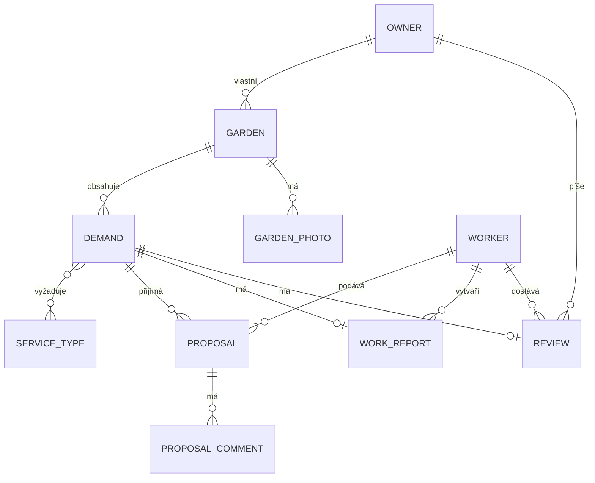
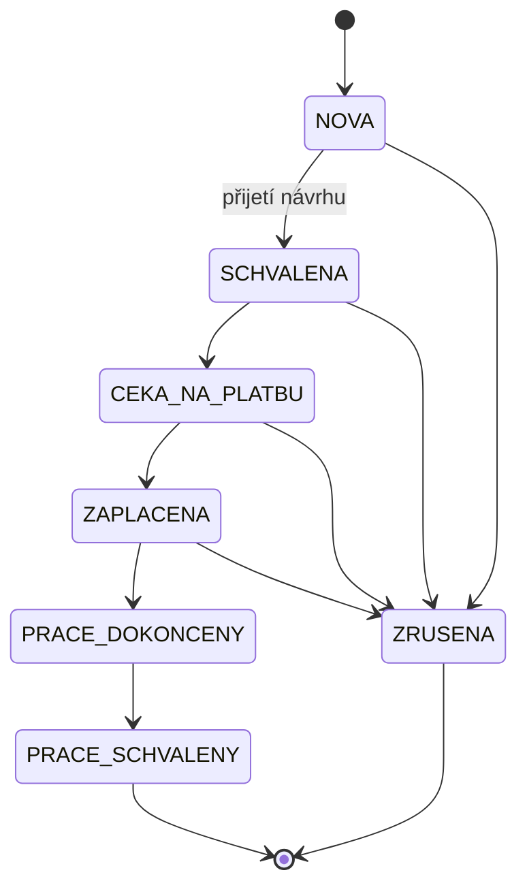
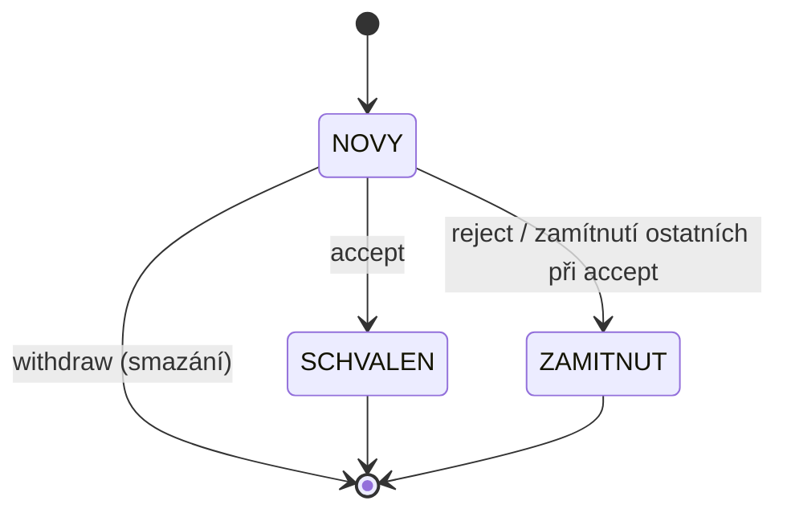

# Technická dokumentace - Zahrada (backend)

Rychlý start a příkazy pro spuštění projektu jsou v `README.md` v kořeni repozitáře. Tento
dokument popisuje architekturu a rozhodnutí, která za implementací stojí, a slouží k posouzení
projektu bez nutnosti ho spouštět.

## 1. Účel aplikace

Zahrada je REST API pro webovou/mobilní aplikaci, která propojuje **vlastníky zahrad** s
**zahradníky**. Vlastník zahrady zadá poptávku (jaké práce potřebuje a s jakou naléhavostí),
zahradníci na ni mohou podat návrh (cenová nabídka a popis), vlastník si vybere jeden z návrhů a
schválí ho - ostatní návrhy se automaticky zamítnou. Aplikace dále eviduje profily obou rolí,
zahrady vlastníka (včetně fotografie) a číselník typů zahradnických služeb.

Cílem backendu je poskytnout bezpečné, dobře zdokumentované a otestované REST API, které
frontend (samostatný projekt) volá přes JSON přes HTTP.

## 2. Použité technologie

| Vrstva | Technologie | Proč zvoleno |
|---|---|---|
| Jazyk / runtime | Java 17 | LTS verze, aktuální požadavek Spring Boot 4 |
| Aplikační framework | Spring Boot 4.0.3 (Spring Framework 7) | standard pro REST backend v Javě, velké ekosystém starterů |
| Web vrstva | Spring MVC (REST, `@RestController`) | integrované ve Spring Bootu, netřeba reaktivní model pro tento rozsah |
| Perzistence | Spring Data JPA + Hibernate | deklarativní repozitáře, méně boilerplate SQL kódu |
| Databáze | H2 (souborový režim `./data/garden` v běhu aplikace, in-memory `testdb` v testech) | nulová instalace/konfigurace pro semestrální projekt, přitom plnohodnotné SQL |
| Zabezpečení | Spring Security (stateless, JWT), BCrypt | de facto standard pro autentizaci/autorizaci ve Spring aplikacích |
| JWT | knihovna JJWT (`io.jsonwebtoken`) | aktivně udržovaná, čisté API pro podpis/validaci tokenu |
| Validace | Jakarta Bean Validation (Hibernate Validator) + vlastní pravidla | deklarativní validace na DTO bez ručního psaní if-else řetězců |
| Dokumentace API | springdoc-openapi (Swagger UI / OpenAPI 3) | generuje se automaticky z anotací kontrolerů, nehrozí rozjetí s realitou |
| Monitoring | Spring Boot Actuator | hotový `/actuator/health` bez vlastní implementace |
| Build | Maven (`./mvnw`) | wrapper nevyžaduje lokální instalaci Mavenu |
| Testování | JUnit 5, Mockito, Spring Boot Test (`MockMvc`), AssertJ | standardní kombinace pro unit i integrační testy ve Spring Bootu |
| Pomocné knihovny | Lombok | redukce boilerplate kódu (gettery/settery/konstruktory) |

## 3. Architektura

Aplikace je postavena jako klasická vrstvená monolitická architektura (bez mikroservisního
dělení - pro rozsah projektu to není potřeba):

```
HTTP request
    |
    v
Controller (REST, @RestController)      - přijme/vrátí DTO, autorizace @PreAuthorize
    |
    v
Service (@Service, @Transactional)      - business logika, vlastnictví záznamů, validace
    |
    v
Repository (Spring Data JPA)            - dotazy nad databází
    |
    v
Entity (@Entity)                        - JPA mapování na tabulky
```

Každá vrstva zná jen tu bezprostředně pod sebou - controller nikdy nevolá repository přímo a
nikdy nepracuje s entitou. Tím je business logika (a její validace) soustředěná na jednom místě
(service) a dá se testovat izolovaně od HTTP i od databáze.

Entita a DTO se záměrně nesmí míchat: kdyby controller vracel entitu přímo, každá změna JPA
mapování (přidané pole, nová vazba) by nekontrolovaně měnila tvar veřejného API. Převod
entita <-> DTO proto dělají oddělené package-private třídy `*Mapper` (např. `DemandMapper`,
`ProposalMapper`, `GardenMapper`) umístěné uvnitř `service/`, ne přímo v service třídě - tak
service obsahuje jen business logiku a mapovací kód (často mechanický, opakující se) jde číst,
testovat i měnit odděleně, aniž by service třída nabobtnala.

Balíčky (`upce.fei.garden.*`):

- **`controller`** - REST endpointy, mapování HTTP metod na service volání, autorizace přes
  `@PreAuthorize`, Swagger anotace (`@Tag`, `@Operation`, `@Parameter`).
- **`service`** - business logika. Každá doménová oblast (Auth, Garden, Demand, Proposal,
  Profile, ServiceType) má vlastní service třídu. Vedle toho `FileStorageService` řeší ukládání
  nahraných souborů na disk (viz [Bezpečnost](#5-bezpečnost)) a je service vrstvě k dispozici
  jako běžná závislost, ne jako samostatná infrastrukturní vrstva navíc.
- **`dto`** - přenosové objekty pro request/response; entity se nikdy nevrací přímo z
  controlleru ven z aplikace.
- **`model`** - JPA entity a jejich enum stavy (`DemandStatus`, `ProposalStatus`, `DemandUrgency`,
  `UserRole`).
- **`repository`** - rozhraní `JpaRepository`/`JpaSpecificationExecutor` s odvozenými i
  vlastními (`@Query`) dotazy.
- **`security`** - JWT filtr a služba, `CurrentUserService` (jednotný přístup k přihlášenému
  uživateli), `SecurityConfig` (pravidla přístupu k jednotlivým cestám).
- **`exception`** - vlastní výjimky a `GlobalExceptionHandler`, který je centrálně převádí na
  jednotný formát chybové odpovědi a loguje.
- **`validation`** - vlastní Bean Validation pravidla (anotace + `ConstraintValidator`).
- **`config`** - průřezová konfigurace nezávislá na doméně: CORS (`CorsConfig`), OpenAPI
  (`OpenApiConfig`), logovací filtr (`RequestLoggingFilter`), naplnění číselníku služeb při
  startu (`ServiceTypeDataInitializer`), registrace H2 konzole mimo testovací profil
  (`H2ConsoleConfig`) a statický resource handler pro nahrané fotografie (`WebMvcConfig`).

Hlavní doménové oblasti a jejich endpointy: autentizace (`/api/auth`), profil
(`/api/profile`), zahrady včetně jejich fotografie (`/api/gardens`), poptávky (`/api/demands`,
veřejný katalog `/api/demands/catalog`, číselník naléhavosti `/api/demands/urgencies`) a návrhy
zahradníků (`/api/demands/{id}/proposals`, `/api/proposals/**`). Entity `WorkReport`, `Review`,
`ProposalComment` a `GardenPhoto` jsou v datovém modelu připravené pro navazující etapy vývoje,
ale zatím nemají REST endpoint (viz [Známá omezení](#11-známá-omezení)).

## 4. Datový model

Klíčové entity a vztahy:



`Owner` a `Worker` dědí společné údaje (e-mail, heslo, jméno, telefon, adresa URL avataru, datum
registrace) z abstraktní entity `User` přes `@Inheritance(strategy = JOINED)` - v databázi tak
vzniknou tři propojené tabulky (`users`, `owner`, `worker`) spojené primárním klíčem, ale v kódu
jde o jednu hierarchii tříd. Alternativou by bylo `SINGLE_TABLE` (jedna široká tabulka se
sloupci pro obě role a diskriminátorem), které je rychlejší na čtení (žádný `JOIN`), ale zde by
vedlo k tabulce plné `NULL` hodnot (pole specifická jen pro vlastníka, nebo jen pro zahradníka) a
znemožnilo by databázové `NOT NULL` a cizí klíče na úrovni role. Vzhledem k tomu, že `Owner` a
`Worker` mají odlišné množiny vlastních polí a datová integrita má přednost před tou minimální
režií navíc jednoho `JOIN`u, byla zvolena varianta `JOINED`.

Vztah `Demand` <-> `ServiceType` je M:N (jedna poptávka může vyžadovat víc typů služeb, jeden typ
služby se objevuje ve víc poptávkách), realizovaný spojovací tabulkou `demand_service_type`.
Naléhavost poptávky (`Demand.urgency`) je pevný číselník `DemandUrgency` (např. `CO_NEJDRIVE`,
`DO_TYDNE`, `FLEXIBILNI`), nabízený frontendu přes `GET /api/demands/urgencies` - záměrně
nahrazuje dřívější návrh s konkrétním požadovaným datem, protože vlastník v praxi zadává spíš
"jak rychle to potřebuji" než přesné datum (viz i [Validace](#6-validace), poznámka k
`@FutureOrToday`).

**Životní cyklus poptávky** (`Demand.status`, enum `DemandStatus`):



Do stavu `NOVA` se poptávka dostane vytvořením a v tomto stavu je jediná viditelná ve veřejném
katalogu pro zahradníky i jediná, na kterou lze podat návrh (`ProposalService#create`). Přechod
do `SCHVALENA` nastává výhradně přijetím jednoho z návrhů, nikdy přímou akcí nad poptávkou
samotnou.

**Životní cyklus návrhu** (`Proposal.status`, enum `ProposalStatus`):



`ProposalService#accept` provede kaskádu ve **stejné transakci** (`@Transactional`): přijímaný
návrh přejde do `SCHVALEN`, všechny ostatní návrhy stejné poptávky (bez ohledu na jejich aktuální
stav) do `ZAMITNUT`, a samotná poptávka do `DemandStatus.SCHVALENA`. Jedna transakce je tu
nutná, ne jen pohodlná - kdyby se tyto tři zápisy provedly odděleně a aplikace by spadla uprostřed,
mohla by nastat nekonzistence (např. dva schválené návrhy na jednu poptávku, nebo schválený
návrh u poptávky, která zůstala ve stavu `NOVA`). Opakované přijetí libovolného návrhu téže
poptávky je tím pádem automaticky zablokované, protože `ensureNovy` odmítne cokoliv, co už není
`NOVY`.

## 5. Bezpečnost

**Průchod požadavku od hlavičky po odpověď:**

1. Klient pošle požadavek s hlavičkou `Authorization: Bearer <token>`.
2. `JwtAuthenticationFilter` (běží před standardním `UsernamePasswordAuthenticationFilter`)
   hlavičku přečte. Pokud token chybí nebo je neplatný, filtr nevyhazuje výjimku ani požadavek
   nezastavuje - jen ho nechá pokračovat dál neautentizovaný. Tím se odpovědnost za odmítnutí
   přesouvá výhradně na autorizační vrstvu níž, filtr sám o sobě nerozhoduje o přístupu.
3. Pokud je token platný, `JwtService` z něj extrahuje e-mail, načte se `UserDetails` a do
   `SecurityContext` se uloží autentizovaný `Authentication` objekt.
4. `SecurityConfig#securityFilterChain` rozhodne, zda daná cesta vůbec vyžaduje autentizaci
   (`PUBLIC_PATHS` a `permitAll` pravidla) - pokud ne, requestu bez platné identity to nevadí.
   Pokud ano a identita chybí, zasáhne `JwtAuthenticationEntryPoint` a vrátí 401 dřív, než se
   požadavek dostane ke controlleru.
5. Pokud identita existuje, teprve na úrovni controlleru rozhoduje `@PreAuthorize("hasRole(...)")`,
   jestli k dané akci smí přistoupit právě role přihlášeného uživatele (403, pokud ne).
6. Pokud role sedí, teprve v service vrstvě se ověřuje vlastnictví konkrétního záznamu.

Veřejné cesty (`SecurityConfig#PUBLIC_PATHS` a explicitní `permitAll` pravidla):
`/api/auth/**`, `/api/demands/catalog`, `/api/demands/urgencies`, `/api/service-types`,
`/uploads/**`, `/swagger-ui/**`, `/v3/api-docs/**`, `/h2-console/**`, `/actuator/health` a dále
`GET /api/demands/{id}` s regexem omezeným na číselné id (`{id:[0-9]+}`) - detail poptávky je
veřejný jen pro čtení ve stavu `NOVA` (o zbytek se stará `DemandService#getById`, viz
[Životní cyklus entit](#4-datový-model)); regex je nutný, aby stejný vzorec cesty omylem
nezpřístupnil neveřejné `/api/demands/statistics` nebo `/api/demands/my`, jejichž poslední
segment cesty by jinak Spring Security interpretoval jako totéž `{id}`.

**Vlastnictví záznamů -> HTTP 404, ne 403.** Pokud se vlastník pokusí přistoupit k zahradě
nebo poptávce jiného vlastníka, nebo zahradník k poptávce mimo veřejný stav `NOVA`, servisní
vrstva to hlásí jako `NotFoundException` (404) - ne jako zákaz přístupu (403). Důvodem je, že
cizímu uživateli nechceme prozrazovat, že daný záznam vůbec existuje - kdyby takový požadavek
vracel 403, útočník by si mohl ověřovat existenci cizích záznamů (a jejich id) jen podle toho,
jestli dostane 403 nebo 404, aniž by k nim měl jakékoliv oprávnění. Tato konvence je jednotná
napříč `GardenService`, `DemandService` i `ProposalService`. Naproti tomu čistě roli patřící
akce (zahradník volající endpoint určený jen vlastníkovi) je odmítnuta dřív, na úrovni
`@PreAuthorize`, a vrací standardní 403 - tam nejde o skrývání existence konkrétního záznamu,
ale o to, že daná role nemá tuto akci k dispozici vůbec, což skrývat nemá smysl.

**Dva úrovně autorizace zároveň** - `SecurityConfig` (které cesty vůbec vyžadují platný token) a
metodová anotace `@PreAuthorize("hasRole(...)")` na controlleru (která přesně roli patří) se
nevylučují, ale doplňují: první vrstva řeší otázku "má vůbec smysl pokračovat bez identity",
druhá až "smí tahle konkrétní role tohle udělat". Rozdělení do dvou míst umožňuje, aby
`SecurityConfig` zůstal čistě deklarativním seznamem cest bez znalosti byznys rolí, zatímco
`@PreAuthorize` zůstává u konkrétní akce, kterou popisuje - lépe se tak čte u samotného
endpointu, kde tato podmínka platí.

**Autentizace a hesla** - autentizace je stateless přes JWT
(`SessionCreationPolicy.STATELESS`, žádná session ani cookie), protože REST API bez stavu na
serveru se snáz škáluje horizontálně a nevyžaduje sdílené úložiště session mezi instancemi.
Token nese e-mail a roli, je podepsaný HMAC klíčem (`app.jwt.secret`) a má omezenou platnost
(`app.jwt.expiration`). Hesla se nikdy neukládají ani neloguji v čitelné podobě - hashují se
přes `BCryptPasswordEncoder`, protože jde o pomalý, solený hash odolný proti offline lámání
hesel (na rozdíl od rychlých obecných hashů jako SHA-256), a v odpovědích API se nikdy nevrací.

**CORS** je omezené jen na doménu frontendu (`http://localhost:5173` v development
konfiguraci) přes samostatný `CorsConfigurationSource` bean, který Spring Security čte přímo -
díky tomu se preflight `OPTIONS` požadavek vyřeší už uvnitř CORS zpracování, dřív, než by k
němu dorazila autorizace a zbytečně ho odmítla jako neautentizovaný.

**Nahrávání souborů (fotografie zahrady)** - `POST /api/gardens/{id}/photo` a
`DELETE /api/gardens/{id}/photo` (viz `GardenController`, `GardenService`) ukládají/mažou
fotografii přes `FileStorageService` na lokální disk pod `app.upload.dir`; výsledná URL se
uloží do `Garden.mainPhotoUrl` a soubor je pak čitelný veřejně přes statický resource handler
`/uploads/**` (`WebMvcConfig`) - jde jen o čtení statického souboru, ne o chráněný API zdroj,
takže nevyžaduje token. Validace nahraného souboru je vrstvená a řeší dvě odlišná rizika:

- **Důvěryhodnost obsahu** - klient nahraný soubor libovolně pojmenuje a nastaví libovolný
  `Content-Type`, oboje je jen metadata, kterým nelze věřit. `FileStorageService#store` proto
  po kontrole velikosti a deklarovaného `Content-Type` navíc přečte prvních 12 bajtů souboru a
  porovná je se signaturou (magic bytes) JPEG/PNG/WebP - teprve pak soubor přijme. Soubor
  přejmenovaný na `.jpg`, ale s jiným obsahem, tak validaci neprojde. Název souboru na disku si
  navíc generuje sama služba (UUID + přípona odvozená ze skutečně detekovaného typu), takže
  originální název od klienta se nikde nepoužije.
- **Path traversal** - protože jméno souboru pro mazání (`FileStorageService#delete`) vzniká z
  URL uložené v `Garden.mainPhotoUrl`, `extractFilename` z ní vezme jen poslední segment cesty
  (za posledním `/`), a `resolveWithinUploadDir` navíc ověří, že výsledná cesta po normalizaci
  skutečně leží uvnitř `app.upload.dir` - dvojitá pojistka pro případ, že by se do URL dostal
  neočekávaný vstup se segmenty typu `../`.

**Monitoring/Actuator** - `/actuator/health` je veřejný a vrací detailní stav (mj. dostupnost
databáze, `management.endpoint.health.show-details=always`), ostatní actuator endpointy
(`/actuator/info`, ...) vyžadují platný token stejně jako zbytek API.

## 6. Validace

Aplikace kombinuje tři úrovně validace:

1. **Standardní Bean Validation** - `@NotBlank`, `@Size`, `@Email`, `@Positive`, `@Pattern` atd.
   na request DTO, vyhodnocované automaticky přes `@Valid` v controlleru.
2. **Vlastní deklarativní pravidla** (balíček `validation`, dělený na `validation.rules` -
   anotace a `validation.validator` - implementace `ConstraintValidator`):
   - `@FutureOrToday` - datum nesmí ležet v minulosti (obecné pravidlo pro `LocalDate` pole,
     aktuálně bez aktivního použití - naléhavost poptávky se od zavedení `DemandUrgency` vybírá
     z pevného číselníku, nikoli konkrétním datem).
   - `@ValidCzechPhone` - telefon ve formátu `+420` a devět číslic (mezery volitelné), `null`
     nebo prázdný řetězec je platný, protože telefon je nepovinný údaj.

   Obě chyby se vrací jako HTTP 400 s mapou `fieldErrors` (název pole -> chybová zpráva), stejně
   jako standardní Bean Validation chyby.
3. **Programová (business) validace** - pravidla, která závisí na stavu souvisejících záznamů
   v databázi nebo na obsahu binárních dat, ne jen na tvaru jednoho DTO, a proto je nelze
   vyjádřit deklarativní anotací nad polem. Příklady: poptávku, ke které už existuje alespoň
   jeden návrh, nelze upravit ani smazat (`DemandService#ensureNoProposals`, HTTP 409); na
   poptávku mimo stav `NOVA` nelze podat návrh a jeden zahradník smí na poptávku podat jen jeden
   návrh (`ProposalService#create`); návrh lze přijmout/zamítnout/odvolat jen ve stavu `NOVY`
   (`ProposalService#ensureNovy`); nahraný soubor fotografie musí projít kontrolou velikosti,
   deklarovaného typu i skutečné signatury obsahu (`FileStorageService#store`, viz
   [Bezpečnost](#5-bezpečnost)). Tato pravidla vyhazují `ConflictException` (409) nebo
   `ValidationException` (400) a jsou zdokumentovaná Javadocem přímo u dané metody.

## 7. Zpracování chyb

`GlobalExceptionHandler` (`@RestControllerAdvice`) centrálně převádí všechny výjimky na jednotný
formát odpovědi `ApiError` (`timestamp`, `status`, `error`, `message`, `path`, volitelně
`fieldErrors`), takže klient nikdy nedostane surový stack trace ani netypizovanou chybu.

| Výjimka / situace | HTTP status |
|---|---|
| `NotFoundException` | 404 |
| `NoResourceFoundException`, `NoHandlerFoundException` (neexistující cesta) | 404 |
| `AuthenticationException` (neplatné přihlašovací údaje) | 401 |
| `ForbiddenException` | 403 |
| `AccessDeniedException` (zamítnutí ze Spring Security, např. `@PreAuthorize`) | 403 |
| `ConflictException` | 409 |
| `ValidationException` (vlastní programová validace) | 400 (s `fieldErrors`) |
| `MethodArgumentNotValidException` (Bean Validation na `@Valid` DTO) | 400 (s `fieldErrors`) |
| `HttpMessageNotReadableException` (poškozený/neplatný JSON) | 400 |
| `MaxUploadSizeExceededException` (soubor větší než `spring.servlet.multipart.max-file-size`) | 400 |
| `HttpRequestMethodNotSupportedException` (nepodporovaná HTTP metoda na dané cestě) | 405 |
| cokoliv jiné (`Exception`) | 500 |

Rozdělení logování mezi jednotlivé handlery odráží, jestli jde o běžný, předvídatelný stav
aplikace, nebo o skutečnou závadu: **očekávané** chyby (celý řádek tabulky kromě posledního) se
logují na úrovni WARN jen se zprávou, bez stack trace - stack trace by tu byl jen šum, protože
příčina (cizí záznam, špatný vstup, konflikt stavu) je vždy zjevná ze zprávy. Poslední řádek,
neočekávaná chyba (500), se loguje na ERROR i s celým stack trace, protože jde o skutečnou
závadu (bug, výpadek závislosti apod.), kterou je potřeba dohledat v kódu - bez stack trace by
nebyla dohledatelná.

## 8. Logování a monitoring

- Logování je přes SLF4J/Logback (výchozí v Spring Boot), aplikační logger `upce.fei.garden`
  běží na úrovni `INFO`; pro ladění lze bez zásahu do kódu dočasně přepnout na `DEBUG` přes
  systémovou vlastnost nebo proměnnou prostředí. SQL dotazy Hibernate jsou v `application.properties`
  natrvalo na `DEBUG` (parametry vazeb dokonce na `TRACE`) - jde o vývojářské pohodlí (vidět
  přesně, jaké SQL a s jakými parametry Hibernate generuje), ne o produkční nastavení.
- Každá klíčová operace (registrace, přihlášení, vytvoření/úprava/smazání zahrady, poptávky nebo
  fotografie, podání/přijetí/zamítnutí/odvolání návrhu) loguje na úrovni `INFO`. Porušení
  oprávnění nebo business pravidla (přístup k cizímu záznamu, akce v neočekávaném stavu,
  odmítnutý soubor při nahrávání apod.) loguje na úrovni `WARN`.
- `GlobalExceptionHandler` odděluje očekávané a neočekávané chyby při logování - viz
  [Zpracování chyb](#7-zpracování-chyb).
- Vlastní `RequestLoggingFilter` loguje na `INFO` každý HTTP požadavek na `/api/**` - metodu,
  cestu, výsledný stavový kód a dobu zpracování. Nikdy neloguje hlavičky ani tělo požadavku,
  takže se do logu nemůže dostat heslo ani JWT token.
- `/actuator/health` (veřejný, s detaily) a `/actuator/info` (pod tokenem) - viz
  [Bezpečnost](#5-bezpečnost).

## 9. Testovací strategie

Testy jsou rozdělené na dvě úrovně a běží proti izolované in-memory H2 databázi (Spring profil
`test`, `application-test.properties`), takže se nikdy nedotknou souborové databáze používané
při běžném provozu aplikace - testy tak lze spouštět opakovaně a paralelně, aniž by si
navzájem nebo s běžícím dev serverem sdílely data.

- **Unit testy** (JUnit 5 + Mockito, bez Spring kontextu) testují business logiku jedné service
  třídy izolovaně - repozitáře a `CurrentUserService` jsou nahrazené mock objekty. Pokrývají
  úspěšné scénáře i očekávané výjimky (neexistující/cizí záznam, konflikt business pravidla,
  neplatná vstupní data). Bez Spring kontextu běží řádově rychleji, takže se hodí na pokrytí
  všech větví business logiky (i těch méně obvyklých), aniž by test suite byla pomalá.
- **Integrační testy** (`@SpringBootTest` + `MockMvc`) běží nad reálným Spring kontextem a
  reálnou (in-memory) databází. Autorizace se v nich neobchází - testovací uživatelé se
  registrují přes skutečný `POST /api/auth/register` a v požadavcích se posílá skutečný vrácený
  JWT token, stejně jako by to dělal reálný klient. Ověřují tak celý řetězec: HTTP -> Spring
  Security -> controller -> service -> databáze -> HTTP odpověď, včetně správných stavových kódů
  (201/403/409/400 s `fieldErrors` apod.) - tuto vrstvu unit testy záměrně nepokrývají, protože
  by vyžadovala mockovat celý Spring Security řetězec.
- Samostatný `GardenApplicationTests` je jednoduchý smoke test, který jen ověří, že se Spring
  kontext s aktuální konfigurací vůbec nastartuje (chybějící bean, špatně zadaná vlastnost apod.
  by test spadl hned, bez nutnosti ručně zkoušet spuštění aplikace).

Třídy testů musí končit na `Test`/`Tests`, ne na `IT` - Maven Surefire (spouštěný fází `test`,
kterou tento projekt používá) třídy s příponou `IT` přeskočí, protože jde o konvenci pluginu
Failsafe pro fázi `integration-test`, kterou projekt nepoužívá. Kdyby integrační testy
omylem skončily na `IT`, `./mvnw test` by je tiše přeskočilo a vypadalo by to, že prošly, i
kdyby se vůbec nespustily.

Spuštění celé sady a další detaily (jak spustit jednu třídu/metodu) jsou v `README.md`, sekce
Testování.

## 10. Známá omezení

- Entity `WorkReport`, `Review` a `ProposalComment` jsou v datovém modelu připravené pro
  navazující etapy vývoje (evidence provedené práce, hodnocení zahradníka, komentáře k návrhu),
  ale zatím k nim není žádný REST endpoint - nejsou tedy ani v Swagger dokumentaci.
- Entita `GardenPhoto` existuje v modelu (viz ER diagram výše) pro budoucí galerii více
  fotografií na zahradu, ale aktuální implementace nahrávání fotografie (`POST /api/gardens/{id}/photo`)
  ji nepoužívá - ukládá jen jednu URL do pole `Garden.mainPhotoUrl`.
- Pole `User.avatarUrl` v entitě existuje, ale nemá vlastní upload endpoint (na rozdíl od
  `Garden.mainPhotoUrl`) - avatar tak lze zatím nastavit jen nepřímo, ne přes API.
