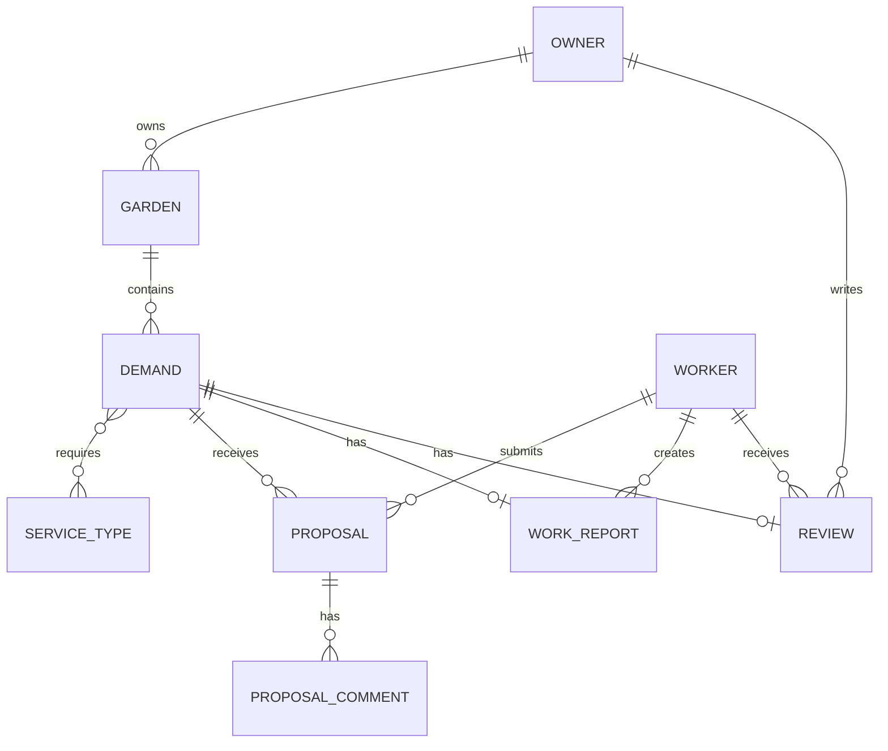
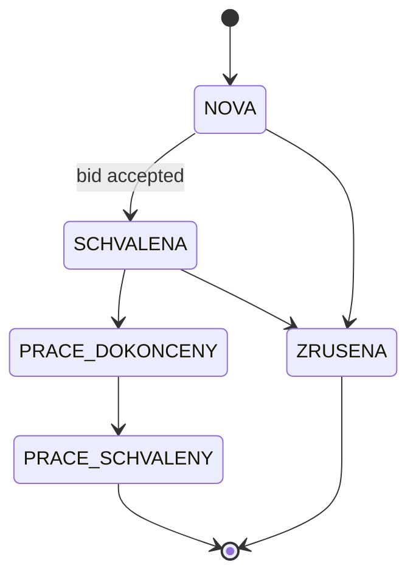
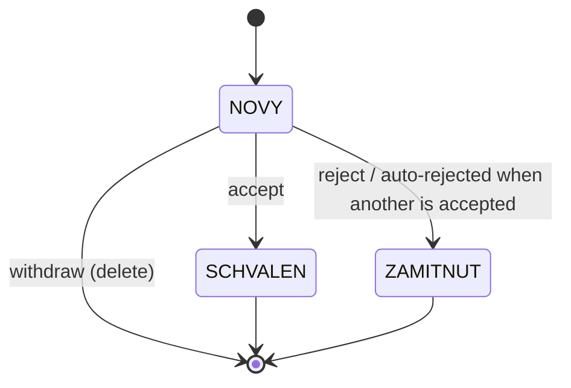

# Technical Documentation - Zahrada (backend)

## 1. Purpose

Zahrada is a REST API for a web/mobile application that connects **garden owners** with
**gardeners**. A garden owner posts a request (what work is needed and how urgent it is),
gardeners can submit a bid on it (a price offer and a short description), the owner picks one bid
and approves it - the other bids are automatically rejected. The application also tracks profiles
for both roles, the owner's gardens (including a photo), and a lookup table of gardening service
types.

The goal of the backend is to provide a secure, well-documented, and well-tested REST API that the
frontend (a separate project) calls over JSON via HTTP.

## 2. Tech stack

| Layer | Technology | Why chosen |
|---|---|---|
| Language | Java 17 | modern LTS version well suited for Spring Boot 4 |
| Backend | Spring Boot 4.0.3 | fast REST API development with proper support for Java 17 |
| API & security | Spring MVC, Spring Security, JWT | standard solution for REST endpoints, authentication, and authorization |
| Data | Spring Data JPA + Hibernate, H2 | simple database work without a separate installation |
| Validation | Bean Validation + custom rules | straightforward validation of input at the DTO level |
| Documentation | OpenAPI / Swagger | automatic API documentation generated from annotations |
| Testing | JUnit 5, Mockito, Spring Boot Test | common and effective stack for both unit and integration tests |
| Build | Maven (`./mvnw`) | simple builds without a local Maven installation |

## 3. Architecture

The application is built as a classic layered monolithic architecture:

```
HTTP request
    |
    v
Controller (REST, @RestController)      - accepts/returns DTOs, authorization via @PreAuthorize
    |
    v
Service (@Service, @Transactional)      - business logic, record ownership, validation
    |
    v
Repository (Spring Data JPA)            - database queries
    |
    v
Entity (@Entity)                        - JPA mapping to tables
```

Each layer only knows the one directly below it - the controller never calls the repository
directly and never works with an entity.

Packages (`upce.fei.garden.*`):

- **`controller`** - REST endpoints, mapping HTTP methods to service calls, authorization via
  `@PreAuthorize`, Swagger annotations (`@Tag`, `@Operation`, `@Parameter`).
- **`service`** - business logic. Each domain area (Auth, Garden, Demand, Proposal, Profile,
  ServiceType) has its own service class. Alongside those, `FileStorageService` handles storing
  uploaded files on disk (see [Security](#5-security)) and is available to the service layer as an
  ordinary dependency.
- **`dto`** - transfer objects for requests/responses; entities are never returned directly from a
  controller outside the application.
- **`model`** - JPA entities and their enum states (`DemandStatus`, `ProposalStatus`,
  `DemandUrgency`, `UserRole`).
- **`repository`** - `JpaRepository`/`JpaSpecificationExecutor` interfaces with both derived and
  custom (`@Query`) queries.
- **`security`** - the JWT filter and service, `CurrentUserService` (the uniform way to get the
  logged-in user), `SecurityConfig` (access rules for individual paths).
- **`exception`** - custom exceptions and `GlobalExceptionHandler`, which centrally converts them
  into a single error response format and logs them.
- **`validation`** - custom Bean Validation rules (annotations + `ConstraintValidator`).
- **`config`** - cross-cutting, domain-independent configuration: CORS (`CorsConfig`), OpenAPI
  (`OpenApiConfig`), the logging filter (`RequestLoggingFilter`), seeding the service-type lookup
  table at startup (`ServiceTypeDataInitializer`), registering the H2 console outside the test
  profile (`H2ConsoleConfig`), and the static resource handler for uploaded photos
  (`WebMvcConfig`).

Main domain areas and their endpoints: authentication (`/api/auth`), profile (`/api/profile`),
gardens including their photo (`/api/gardens`), requests (`/api/demands`, the public catalog
`/api/demands/catalog`, the urgency lookup `/api/demands/urgencies`), and gardeners' bids
(`/api/demands/{id}/proposals`, `/api/proposals/**`). `WorkReport` and `Review` also have their
own REST endpoints (`/api/demands/{id}/work-report`, `/api/worker/jobs`, and
`/api/demands/{id}/accept-work`). Only `ProposalComment` remains without a direct REST endpoint -
it's created as a side effect of `POST /api/proposals/{id}/request-changes` rather than through
its own CRUD route (see [Known limitations](#10-known-limitations)).

## 4. Data model

Key entities and relationships:



`Owner` and `Worker` inherit shared data (email, password, name, phone, avatar URL, registration
date) from the abstract `User` entity via `@Inheritance(strategy = JOINED)` - in the database this
produces three linked tables (`users`, `owner`, `worker`) joined by primary key, but in code it's a
single class hierarchy.

**Request lifecycle** (`Demand.status`, enum `DemandStatus`):



A request reaches `NOVA` on creation, and in this status alone it is visible in the public catalog
for gardeners and the only one a bid can be submitted on (`ProposalService#create`). The
transition to `SCHVALENA` happens exclusively by accepting one of the bids.

**Bid lifecycle** (`Proposal.status`, enum `ProposalStatus`):



`ProposalService#accept` makes all the changes at once in a single transaction. When one bid is
accepted, that bid is marked `SCHVALEN`, every other bid on the same request is rejected, and the
request itself moves to `SCHVALENA`.

## 5. Security

The application uses a simple, straightforward security model:

- Access is protected using JWT and roles (`OWNER`, `WORKER`).
- The client sends the token in the `Authorization: Bearer <token>` header.
- `JwtAuthenticationFilter` verifies the token, but the actual access decision is made later by
  `SecurityConfig` and `@PreAuthorize` on the controller.
- Public paths include, for example, registration, the request catalog, the list of service
  types, uploads, Swagger, and the health endpoint.
- Access to someone else's record returns `404` instead of `403`, so the record's existence isn't
  revealed.
- Passwords are stored as a BCrypt hash, and the JWT is stateless with a limited lifetime.
- CORS is allowed only for the frontend at `http://localhost:5173`.
- Uploaded photos are checked before being stored - both their declared type and actual content
  are inspected, to prevent upload-type abuse or path traversal.
- `/actuator/health` is public; other actuator endpoints require authentication.

## 6. Validation

The application combines three levels of validation:

1. **Standard Bean Validation** - `@NotBlank`, `@Size`, `@Email`, `@Positive`, `@Pattern`, etc. on
   request DTOs, evaluated automatically via `@Valid` in the controller.
2. **Custom declarative rules** (the `validation` package, split into `validation.rules` -
   annotations - and `validation.validator` - `ConstraintValidator` implementations):
   - `@ValidCzechPhone` - a phone number in the format `+420` plus nine digits (spaces optional);
     `null` or an empty string is valid, since the phone field is optional.

3. **Programmatic (business) validation** - rules that depend on the state of related records in
   the database or on the content of binary data, not just the shape of a single DTO, and
   therefore can't be expressed as a declarative annotation on a field.

   Examples: a request that already has at least one bid can't be edited or deleted
   (`DemandService#ensureNoProposals`, HTTP 409); a bid can't be submitted on a request outside
   status `NOVA`, and a gardener may submit only one bid per request (`ProposalService#create`); a
   bid can only be accepted/rejected/withdrawn in an allowed status (`ProposalService#ensureStatus`);
   an uploaded photo file must pass checks on size, declared type, and actual content signature
   (`FileStorageService#store`, see [Security](#5-security)). These rules throw
   `ConflictException` (409) or `ValidationException` (400) and are documented in the Javadoc
   right on the relevant method.

## 7. Error handling

`GlobalExceptionHandler` (`@RestControllerAdvice`) centrally converts every exception into a
single `ApiError` response format (`timestamp`, `status`, `error`, `message`, `path`, optionally
`fieldErrors`), so the client never receives a raw stack trace or an untyped error.

| Exception / situation | HTTP status |
|---|---|
| `NotFoundException` | 404 |
| `NoResourceFoundException`, `NoHandlerFoundException` (nonexistent path) | 404 |
| `AuthenticationException` (invalid credentials) | 401 |
| `ForbiddenException` | 403 |
| `AccessDeniedException` (denied by Spring Security, e.g. `@PreAuthorize`) | 403 |
| `ConflictException` | 409 |
| `ValidationException` (custom programmatic validation) | 400 (with `fieldErrors`) |
| `MethodArgumentNotValidException` (Bean Validation on a `@Valid` DTO) | 400 (with `fieldErrors`) |
| `HttpMessageNotReadableException` (malformed/invalid JSON) | 400 |
| `MaxUploadSizeExceededException` (file larger than `spring.servlet.multipart.max-file-size`) | 400 |
| `HttpRequestMethodNotSupportedException` (unsupported HTTP method on a given path) | 405 |
| anything else (`Exception`) | 500 |

## 8. Logging and monitoring

- The application uses SLF4J/Logback. The main logger is `upce.fei.garden`.
- Important actions are logged at `INFO` level (registration, creating or changing data, file
  upload, accepting or rejecting a bid).
- Unauthorized actions or rule violations are logged as `WARN`.
- `RequestLoggingFilter` records every request to `/api/**` with method, path, status, and
  processing time. It doesn't store headers or the request body.
- `/actuator/health` is public and allows simple monitoring of application health.

## 9. Testing strategy

The project has two test layers and uses an isolated in-memory database in the test profile.

- **Unit tests** cover the business logic of the service layer. They test both the main scenarios
  and error cases.
- **Integration tests** verify the whole flow over HTTP, through Spring Security, the controller,
  the service, and the database.
- There is also a simple smoke test that verifies the application starts up correctly.
- Tests are named following the `*Test` or `*Tests` convention so Maven runs them correctly.
- Details on running the tests are in `README.md`.

## 10. Known limitations

- `ProposalComment` exists in the data model (feedback from the owner when requesting changes to
  a bid), but has no direct CRUD REST endpoint of its own yet - it's created only as a side effect
  of `POST /api/proposals/{id}/request-changes`.
- The `User.avatarUrl` field exists on the entity but has no dedicated upload endpoint (unlike
  `Garden.mainPhotoUrl`) - an avatar can currently only be set indirectly, not through the API.
