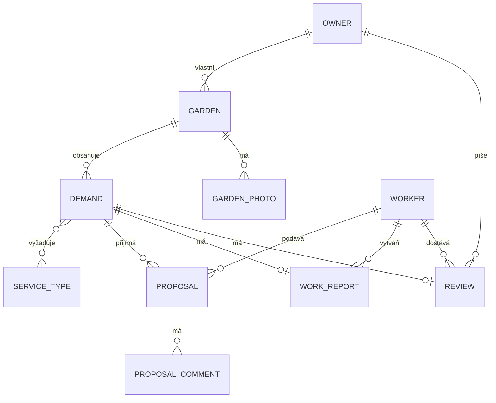

# Technická dokumentace - Zahrada (backend)

## 1. Účel aplikace

Zahrada je REST API pro webovou/mobilní aplikaci, která propojuje **vlastníky zahrad** s
**zahradníky**. Vlastník zahrady zadá poptávku (jaké práce potřebuje a kdy), zahradníci na ni
mohou podat návrh (cenová nabídka a popis), vlastník si vybere jeden z návrhů a schválí ho -
ostatní návrhy se automaticky zamítnou. Aplikace dále eviduje profily obou rolí, zahrady
vlastníka a číselník typů zahradnických služeb.

Cílem backendu je poskytnout bezpečné, dobře zdokumentované a otestované REST API, které
frontend (samostatný projekt) volá přes JSON přes HTTP.

## 2. Použité technologie

| Vrstva | Technologie |
|---|---|
| Jazyk / runtime | Java 17 |
| Aplikační framework | Spring Boot 4 (Spring Framework 7) |
| Web vrstva | Spring MVC (REST, `@RestController`) |
| Perzistence | Spring Data JPA + Hibernate |
| Databáze | H2 (souborový režim `./data/garden` v běhu aplikace, in-memory `testdb` v testech) |
| Zabezpečení | Spring Security (stateless, JWT), BCrypt |
| JWT | knihovna JJWT (`io.jsonwebtoken`) |
| Validace | Jakarta Bean Validation (Hibernate Validator) + vlastní pravidla |
| Dokumentace API | springdoc-openapi (Swagger UI / OpenAPI 3) |
| Monitoring | Spring Boot Actuator |
| Build | Maven (`./mvnw`) |
| Testování | JUnit 5, Mockito, Spring Boot Test (`MockMvc`), AssertJ |
| Pomocné knihovny | Lombok (redukce boilerplate kódu - gettery/settery/konstruktory) |

## 3. Architektura

Aplikace je postavena jako klasická vrstvená monolitická architektura (bez mikroservisního
dělení - pro rozsah projektu to není potřeba):

```
HTTP request
    │
    ▼
Controller (REST, @RestController)      - přijme/vrátí DTO, autorizace @PreAuthorize
    │
    ▼
Service (@Service, @Transactional)      - business logika, vlastnictví záznamů, validace
    │
    ▼
Repository (Spring Data JPA)            - dotazy nad databází
    │
    ▼
Entity (@Entity)                        - JPA mapování na tabulky
```

Balíčky (`upce.fei.garden.*`):

- **`controller`** - REST endpointy, mapování HTTP metod na service volání, autorizace přes
  `@PreAuthorize`, Swagger anotace (`@Tag`, `@Operation`, `@Parameter`).
- **`service`** - business logika. Každá doménová oblast (Auth, Garden, Demand, Proposal,
  Profile, ServiceType) má vlastní service třídu. Převod entita ↔ DTO dělají oddělené
  package-private třídy `*Mapper` (např. `DemandMapper`), aby service třída obsahovala jen
  business logiku, ne mapovací kód.
- **`dto`** - přenosové objekty pro request/response; entity se nikdy nevrací přímo z
  controlleru ven z aplikace.
- **`model`** - JPA entity a jejich enum stavy (`DemandStatus`, `ProposalStatus`, `UserRole`).
- **`repository`** - rozhraní `JpaRepository`/`JpaSpecificationExecutor` s odvozenými i
  vlastními (`@Query`) dotazy.
- **`security`** - JWT filtr a služba, `CurrentUserService` (jednotný přístup k přihlášenému
  uživateli), `SecurityConfig` (pravidla přístupu k jednotlivým cestám).
- **`exception`** - vlastní výjimky a `GlobalExceptionHandler`, který je centrálně převádí na
  jednotný formát chybové odpovědi a loguje.
- **`validation`** - vlastní Bean Validation pravidla (anotace + `ConstraintValidator`).
- **`config`** - průřezová konfigurace nezávislá na doméně (CORS, OpenAPI, logovací filtr,
  naplnění číselníku služeb při startu).

Hlavní doménové oblasti a jejich endpointy: autentizace (`/api/auth`), profil
(`/api/profile`), zahrady (`/api/gardens`), poptávky (`/api/demands`, veřejný katalog
`/api/demands/catalog`) a návrhy zahradníků (`/api/demands/{id}/proposals`,
`/api/proposals/**`). Entity `WorkReport`, `Review`, `ProposalComment` a `GardenPhoto` jsou v
datovém modelu připravené pro navazující etapy vývoje, ale zatím nemají REST endpoint.

## 4. Datový model

Klíčové entity a vztahy:



`Owner` a `Worker` dědí společné údaje (e-mail, heslo, jméno, telefon, avatar, datum
registrace) z abstraktní entity `User` přes `@Inheritance(strategy = JOINED)` - v databázi tak
vzniknou tři propojené tabulky (`users`, `owner`, `worker`) spojené primárním klíčem.

Vztah `Demand` ↔ `ServiceType` je M:N (jedna poptávka může vyžadovat víc typů služeb, jeden typ
služby se objevuje ve víc poptávkách), realizovaný spojovací tabulkou `demand_service_type`.

**Životní cyklus poptávky** (`Demand.status`, enum `DemandStatus`):

```
NOVA → SCHVALENA → CEKA_NA_PLATBU → ZAPLACENA → PRACE_DOKONCENY → PRACE_SCHVALENY
                                                                        (ZRUSENA kdykoliv)
```

Do stavu `NOVA` se poptávka dostane vytvořením a v tomto stavu je jediná viditelná ve veřejném
katalogu pro zahradníky. Přijetím jednoho z návrhů (`ProposalService#accept`) přejde do
`SCHVALENA` a zároveň se všechny ostatní návrhy stejné poptávky zamítnou (`ZAMITNUT`) - to celé
proběhne v jedné transakci.

**Životní cyklus návrhu** (`Proposal.status`, enum `ProposalStatus`): `NOVY → SCHVALEN` nebo
`NOVY → ZAMITNUT`. Zahradník smí svůj návrh odvolat (smazat), jen dokud je ve stavu `NOVY`.

## 5. Zabezpečení

- **Autentizace** je stateless přes JWT (bez session, bez cookies - `SessionCreationPolicy.STATELESS`).
  Token se získá registrací nebo přihlášením (`POST /api/auth/register`, `/login`), nese e-mail
  a roli uživatele, je podepsaný HMAC klíčem (`app.jwt.secret`) a má omezenou platnost
  (`app.jwt.expiration`). Klient ho posílá v hlavičce `Authorization: Bearer <token>`.
  `JwtAuthenticationFilter` běží před standardním `UsernamePasswordAuthenticationFilter`, ověří
  platnost tokenu a naplní `SecurityContext`; neplatný nebo chybějící token požadavek sám o sobě
  nezastaví - o odmítnutí (401) rozhodne až autorizační pravidlo pro danou cestu.
- **Hesla** se nikdy neukládají ani neloguji v čitelné podobě - hashují se přes
  `BCryptPasswordEncoder` a v odpovědích API se nikdy nevrací.
- **Autorizace podle role** je na dvou úrovních: `SecurityConfig` určuje, které cesty jsou
  veřejné (registrace/přihlášení, katalog poptávek, číselník služeb, Swagger, `/actuator/health`)
  a které vyžadují libovolný platný token; anotace `@PreAuthorize("hasRole(...)")` na
  jednotlivých controller metodách pak určuje, které roli (`OWNER`/`WORKER`) je daná akce
  dostupná.
- **Vlastnictví záznamů → HTTP 404, ne 403.** Pokud se vlastník pokusí přistoupit k zahradě
  nebo poptávce jiného vlastníka, nebo zahradník k poptávce mimo veřejný stav `NOVA`, servisní
  vrstva to hlásí jako `NotFoundException` (404) - ne jako zákaz přístupu (403). Důvodem je, že
  cizímu uživateli nechceme prozrazovat, že daný záznam vůbec existuje. Tato konvence je
  jednotná napříč `GardenService`, `DemandService` i `ProposalService`. Naproti tomu čistě
  roli patřící akce (zahradník volající endpoint určený jen vlastníkovi) je odmítnuta dřív, na
  úrovni `@PreAuthorize`, a vrací standardní 403.
- **CORS** je omezené jen na doménu frontendu (`http://localhost:5173` v development
  konfiguraci) přes samostatný `CorsConfigurationSource` bean, který Spring Security čte přímo
  (preflight `OPTIONS` požadavek se tak vyřeší dřív, než k němu dorazí autorizace).
- **Monitoring/Actuator** - `/actuator/health` je veřejný a vrací detailní stav (mj. dostupnost
  databáze), ostatní actuator endpointy (`/actuator/info`, ...) vyžadují platný token stejně
  jako zbytek API.

## 6. Validace

Aplikace kombinuje tři úrovně validace:

1. **Standardní Bean Validation** - `@NotBlank`, `@Size`, `@Email`, `@Positive`, `@Pattern` atd.
   na request DTO, vyhodnocované automaticky přes `@Valid` v controlleru.
2. **Vlastní deklarativní pravidla** (balíček `validation`, dělený na `validation.rules` -
   anotace a `validation.validator` - implementace `ConstraintValidator`):
   - `@FutureOrToday` - datum nesmí ležet v minulosti (použito na `desiredDate` poptávky).
   - `@ValidCzechPhone` - telefon ve formátu `+420` a devět číslic (mezery volitelné), `null`
     nebo prázdný řetězec je platný, protože telefon je nepovinný údaj.

   Obě chyby se vrací jako HTTP 400 s mapou `fieldErrors` (název pole → chybová zpráva), stejně
   jako standardní Bean Validation chyby.
3. **Programová (business) validace** - pravidla, která závisí na stavu souvisejících záznamů
   v databázi, ne jen na tvaru jednoho DTO, a proto je nelze vyjádřit deklarativní anotací nad
   polem. Příklady: poptávku, ke které už existuje alespoň jeden návrh, nelze upravit ani
   smazat (`DemandService#ensureNoProposals`, HTTP 409); na poptávku mimo stav `NOVA` nelze
   podat návrh a jeden zahradník smí na poptávku podat jen jeden návrh
   (`ProposalService#create`); návrh lze přijmout/zamítnout/odvolat jen ve stavu `NOVY`
   (`ProposalService#ensureNovy`). Tato pravidla vyhazují `ConflictException` (409) nebo
   `ValidationException` (400) a jsou zdokumentovaná Javadocem přímo u dané metody.

## 7. Logování

- Logování je přes SLF4J/Logback (výchozí v Spring Boot), aplikační logger `upce.fei.garden`
  běží na úrovni `INFO`; pro ladění lze bez zásahu do kódu dočasně přepnout na `DEBUG` přes
  systémovou vlastnost nebo proměnnou prostředí.
- Každá klíčová operace (registrace, přihlášení, vytvoření/úprava/smazání zahrady nebo
  poptávky, podání/přijetí/zamítnutí/odvolání návrhu) loguje na úrovni `INFO`. Porušení
  oprávnění nebo business pravidla (přístup k cizímu záznamu, akce v neočekávaném stavu,
  pokus o duplicitní registraci apod.) loguje na úrovni `WARN`.
- `GlobalExceptionHandler` odděluje **očekávané** chyby (400/401/403/404/409...) - logují se na
  `WARN` jen se zprávou, bez stack trace, protože jde o běžné, předvídatelné stavy aplikace - od
  **neočekávané** chyby (500) - ta se loguje na `ERROR` i s celým stack trace, protože jde o
  skutečnou závadu, kterou je potřeba dohledat v kódu.
- Vlastní `RequestLoggingFilter` loguje na `INFO` každý HTTP požadavek na `/api/**` - metodu,
  cestu, výsledný stavový kód a dobu zpracování. Nikdy neloguje hlavičky ani tělo požadavku,
  takže se do logu nemůže dostat heslo ani JWT token.

## 8. Testování

Testy jsou rozdělené na dvě úrovně a běží proti izolované in-memory H2 databázi (Spring profil
`test`, `application-test.properties`), takže se nikdy nedotknou souborové databáze používané
při běžném provozu aplikace.

- **Unit testy** (JUnit 5 + Mockito, bez Spring kontextu) testují business logiku jedné service
  třídy izolovaně - repozitáře a `CurrentUserService` jsou nahrazené mock objekty. Pokrývají
  úspěšné scénáře i očekávané výjimky (neexistující/cizí záznam, konflikt business pravidla,
  neplatná vstupní data).
- **Integrační testy** (`@SpringBootTest` + `MockMvc`) běží nad reálným Spring kontextem a
  reálnou (in-memory) databází. Autorizace se v nich neobchází - testovací uživatelé se
  registrují přes skutečný `POST /api/auth/register` a v požadavcích se posílá skutečný vrácený
  JWT token, stejně jako by to dělal reálný klient. Ověřují tak celý řetězec: HTTP → Spring
  Security → controller → service → databáze → HTTP odpověď, včetně správných stavových kódů
  (201/403/409/400 s `fieldErrors` apod.).

Celá sada se spouští příkazem:

```bash
./mvnw test
```

Detailnější popis (rozdělení tříd, konvence pojmenování) je v `README.md`, sekce Testování.
